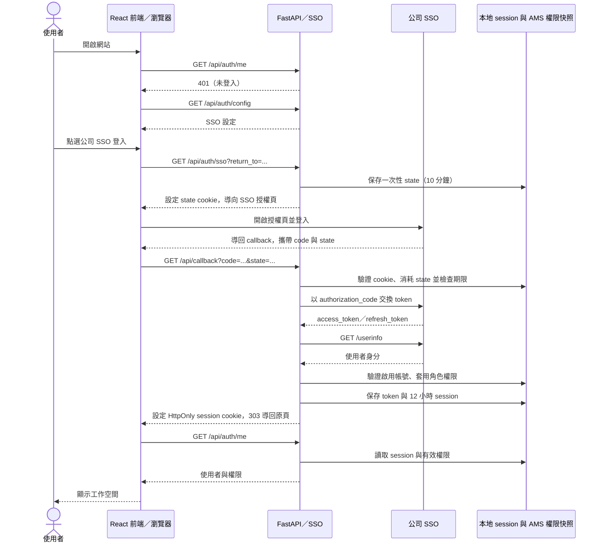
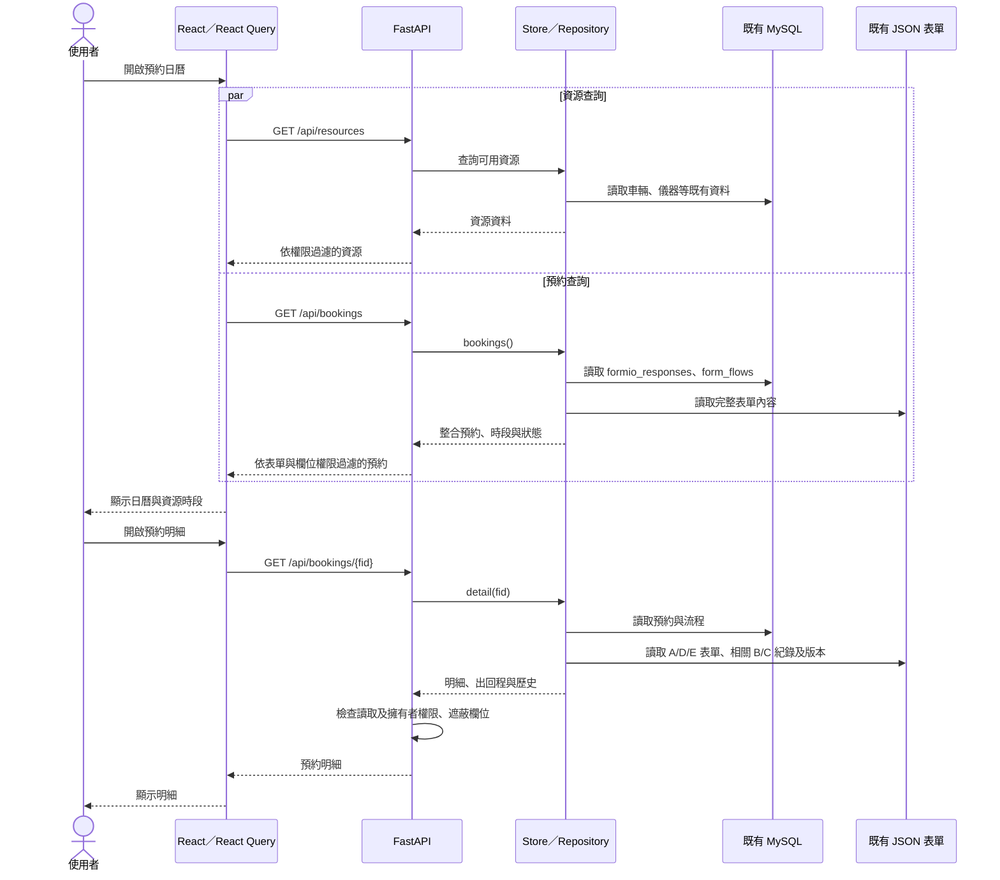
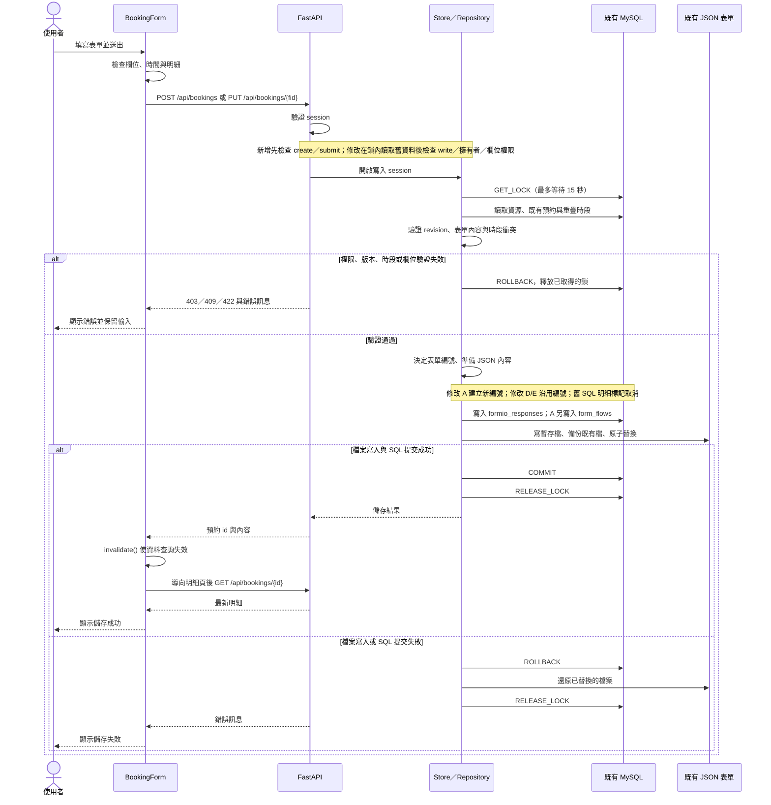
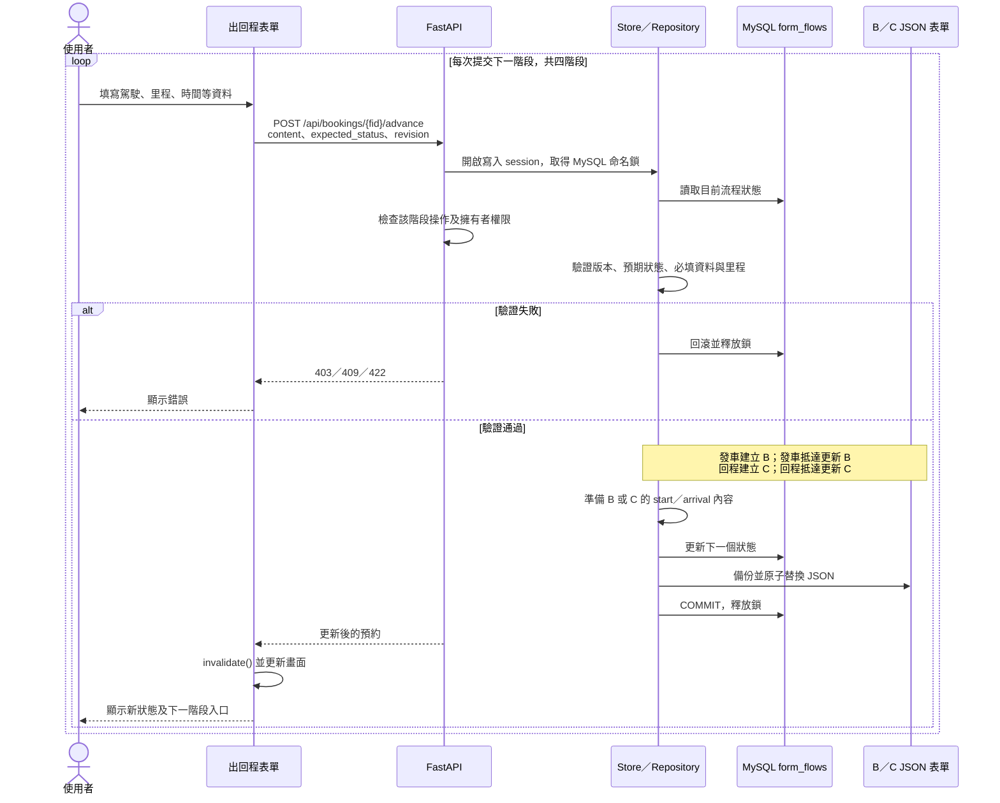
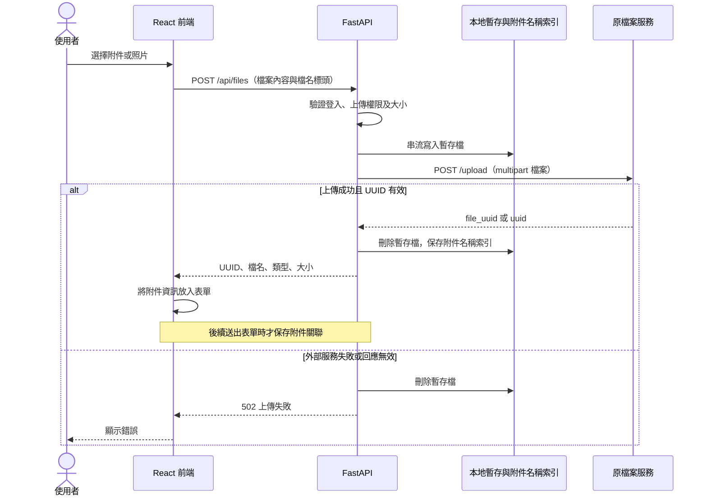

# POLIMAX Next 時序圖

從登入頁開始的 16 段詳細流程，請見 [逐步時序圖](USER_JOURNEY_SEQUENCE.md)。

依目前正式 MySQL／SSO 模式的原始碼整理，不含隔離 demo 模式。箭頭代表請求或內部呼叫，虛線代表回應；圖中省略部分欄位與 UI 操作。所有受保護 API 都會驗證 session，並依端點檢查權限。

## 1. SSO 登入

Token 僅保存在後端。受保護請求距離上次驗證超過 60 秒時，後端再次呼叫 `/userinfo`；若回傳 401 且有 refresh token，則嘗試刷新，失敗時要求重新登入。非正式主機進入登入端點時會先導向設定的正式主機。

## 2. 查詢日曆與預約

日曆另有假日查詢；掛載約兩秒後會呼叫通知檢查，正式 API 回覆 409（由既有程序處理），前端忽略此錯誤。以上聚焦主要資料讀取。

## 3. 新增／修改預約（A 車輛、D 作業區、E 儀器）

前端直接送出新增／修改請求，沒有先呼叫 `/api/bookings/check`。衝突檢查在儲存鎖內執行，包含相接時間邊界。SQL 與檔案系統並非同一筆原子交易；上圖回復流程指程式可捕捉的正常錯誤。

## 4. 車輛出回程

狀態順序：`PENDING`（已預約）→ `DEPARTURE`（已發車）→ `DEPARTURE_ARRIVED`（發車已抵達）→ `RETURN`（已開始回程）→ `RETURN_ARRIVED`（已完成）。儲存失敗的回滾方式同圖 3。

## 5. 附件上傳

## 程式依據

- `src/App.tsx`、`src/api.ts`：登入、session 查詢、API 包裝與查詢更新。
- `src/Calendar.tsx`、`src/Bookings.tsx`：日曆、預約查詢與送出。
- `src/Stages.tsx`：出回程送出。
- `backend/sso.py`：SSO、state、session、權限與 token 刷新。
- `backend/legacy_api.py`：正式 API、權限與附件轉接。
- `backend/legacy_store.py`：MySQL／JSON 整合、命名鎖、交易與狀態轉換。
