# POLIMAX Next：從登入開始的逐步時序圖

依正式 SSO + MySQL 模式的原始碼整理。閱讀順序為開啟網站 → 登入 → 首頁 → 選擇功能 → 操作 → 登出。功能頁是登入後的分支，不必依序操作全部頁面。外部 SSO 的帳密驗證內部流程不在本專案範圍。

各圖以 autonumber 標示訊息順序。前端包含 React 與瀏覽器；後端為 FastAPI。查詢圖表示需要取得資料時的流程，React Query 可能重用仍有效的快取，並非每次點擊都重新發送請求。

## 01｜開啟網站：顯示登入頁或直接進入工作空間

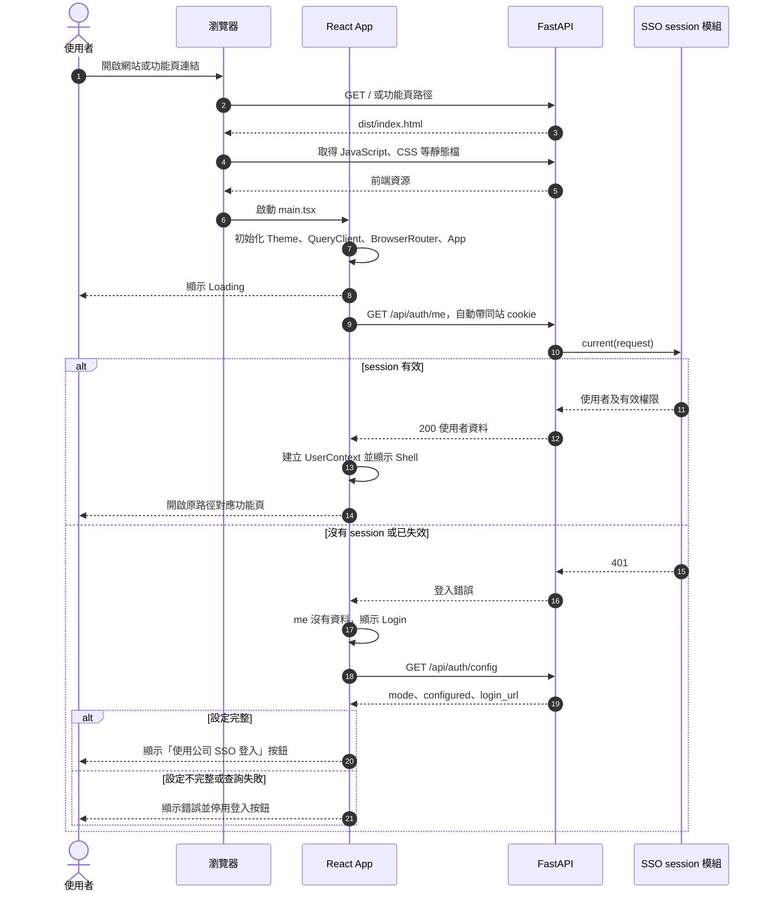
```mermaid
sequenceDiagram
    autonumber
    actor U as 使用者
    participant B as 瀏覽器
    participant F as React App
    participant A as FastAPI
    participant S as SSO session 模組
    U->>B: 開啟網站或功能頁連結
    B->>A: GET / 或功能頁路徑
    A-->>B: dist/index.html
    B->>A: 取得 JavaScript、CSS 等靜態檔
    A-->>B: 前端資源
    B->>F: 啟動 main.tsx
    F->>F: 初始化 Theme、QueryClient、BrowserRouter、App
    F-->>U: 顯示 Loading
    F->>A: GET /api/auth/me，自動帶同站 cookie
    A->>S: current(request)
    alt session 有效
        S-->>A: 使用者及有效權限
        A-->>F: 200 使用者資料
        F->>F: 建立 UserContext 並顯示 Shell
        F-->>U: 開啟原路徑對應功能頁
    else 沒有 session 或已失效
        S-->>A: 401
        A-->>F: 登入錯誤
        F->>F: me 沒有資料，顯示 Login
        F->>A: GET /api/auth/config
        A-->>F: mode、configured、login_url
        alt 設定完整
            F-->>U: 顯示「使用公司 SSO 登入」按鈕
        else 設定不完整或查詢失敗
            F-->>U: 顯示錯誤並停用登入按鈕
        end
    end
```

`App` 以 me.data 是否存在決定畫面：已有有效 cookie 就直接進入；初次身分查詢因其他錯誤而沒有資料時，也會呈現 Login。若 dist/index.html 尚未建置，正式服務會回傳 503。

## 02｜按下「使用公司 SSO 登入」

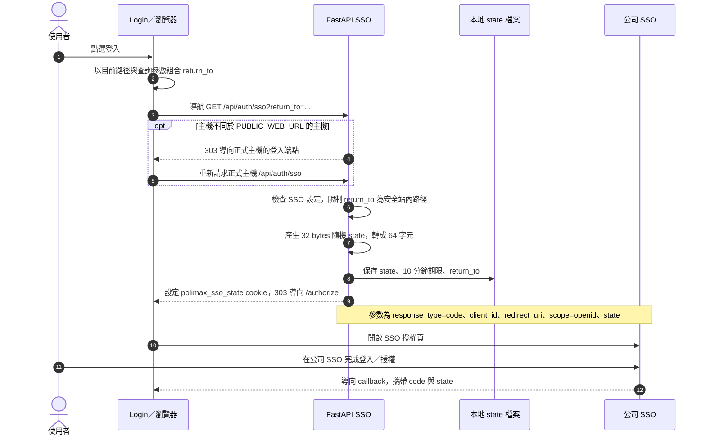
```mermaid
sequenceDiagram
    autonumber
    actor U as 使用者
    participant F as Login／瀏覽器
    participant A as FastAPI SSO
    participant L as 本地 state 檔案
    participant I as 公司 SSO
    U->>F: 點選登入
    F->>F: 以目前路徑與查詢參數組合 return_to
    F->>A: 導航 GET /api/auth/sso?return_to=...
    opt 主機不同於 PUBLIC_WEB_URL 的主機
        A-->>F: 303 導向正式主機的登入端點
        F->>A: 重新請求正式主機 /api/auth/sso
    end
    A->>A: 檢查 SSO 設定，限制 return_to 為安全站內路徑
    A->>A: 產生 32 bytes 隨機 state，轉成 64 字元
    A->>L: 保存 state、10 分鐘期限、return_to
    A-->>F: 設定 polimax_sso_state cookie，303 導向 /authorize
    Note over A,I: 參數為 response_type=code、client_id、redirect_uri、scope=openid、state
    F->>I: 開啟 SSO 授權頁
    U->>I: 在公司 SSO 完成登入／授權
    I-->>F: 導向 callback，攜帶 code 與 state
```

POLIMAX 登入頁不收集公司密碼。若頁面網址已有 sso_error，前端會顯示錯誤，重新登入時不將這段查詢帶入 return_to。SSO 設定不完整時，登入端點回傳 503。

## 03｜SSO 回呼：驗證、交換 token、載入權限、建立 session

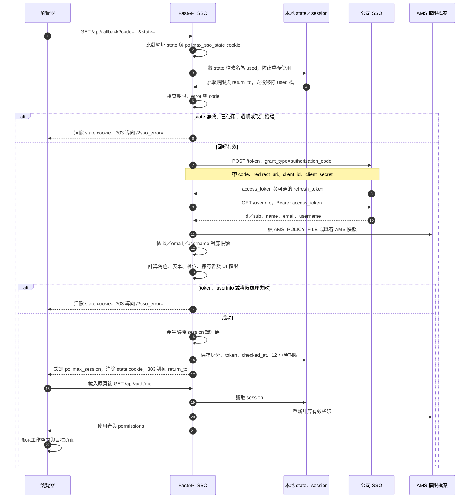
```mermaid
sequenceDiagram
    autonumber
    participant F as 瀏覽器
    participant A as FastAPI SSO
    participant L as 本地 state／session
    participant I as 公司 SSO
    participant P as AMS 權限檔案
    F->>A: GET /api/callback?code=...&state=...
    A->>A: 比對網址 state 與 polimax_sso_state cookie
    A->>L: 將 state 檔改名為 used，防止重複使用
    L-->>A: 讀取期限與 return_to，之後移除 used 檔
    A->>A: 檢查期限、error 與 code
    alt state 無效、已使用、過期或取消授權
        A-->>F: 清除 state cookie，303 導向 /?sso_error=...
    else 回呼有效
        A->>I: POST /token，grant_type=authorization_code
        Note over A,I: 帶 code、redirect_uri、client_id、client_secret
        I-->>A: access_token 與可選的 refresh_token
        A->>I: GET /userinfo，Bearer access_token
        I-->>A: id／sub、name、email、username
        A->>P: 讀 AMS_POLICY_FILE 或既有 AMS 快照
        A->>A: 依 id／email／username 對應帳號
        A->>A: 計算角色、表單、欄位、擁有者及 UI 權限
        alt token、userinfo 或權限處理失敗
            A-->>F: 清除 state cookie，303 導向 /?sso_error=...
        else 成功
            A->>A: 產生隨機 session 識別碼
            A->>L: 保存身分、token、checked_at、12 小時期限
            A-->>F: 設定 polimax_session，清除 state cookie，303 導回 return_to
            F->>A: 載入原頁後 GET /api/auth/me
            A->>L: 讀取 session
            A->>P: 重新計算有效權限
            A-->>F: 使用者與 permissions
            F->>F: 顯示工作空間與目標頁面
        end
    end
```

預設快照模式會檢查帳號與角色是否啟用；帳號未在 AMS 啟用、含尚未對應的個別資料限制，都會拒絕登入。自訂 AMS_POLICY_FILE 則使用該政策的帳號角色對應。

cookie 為 HttpOnly、SameSite=Lax、Path=/，正式網址為 HTTPS 時加 Secure。access/refresh token 留在後端 .data/sso/，瀏覽器只持有隨機 session 識別碼。

## 04｜登入後每個受保護 API 的身分檢查與刷新

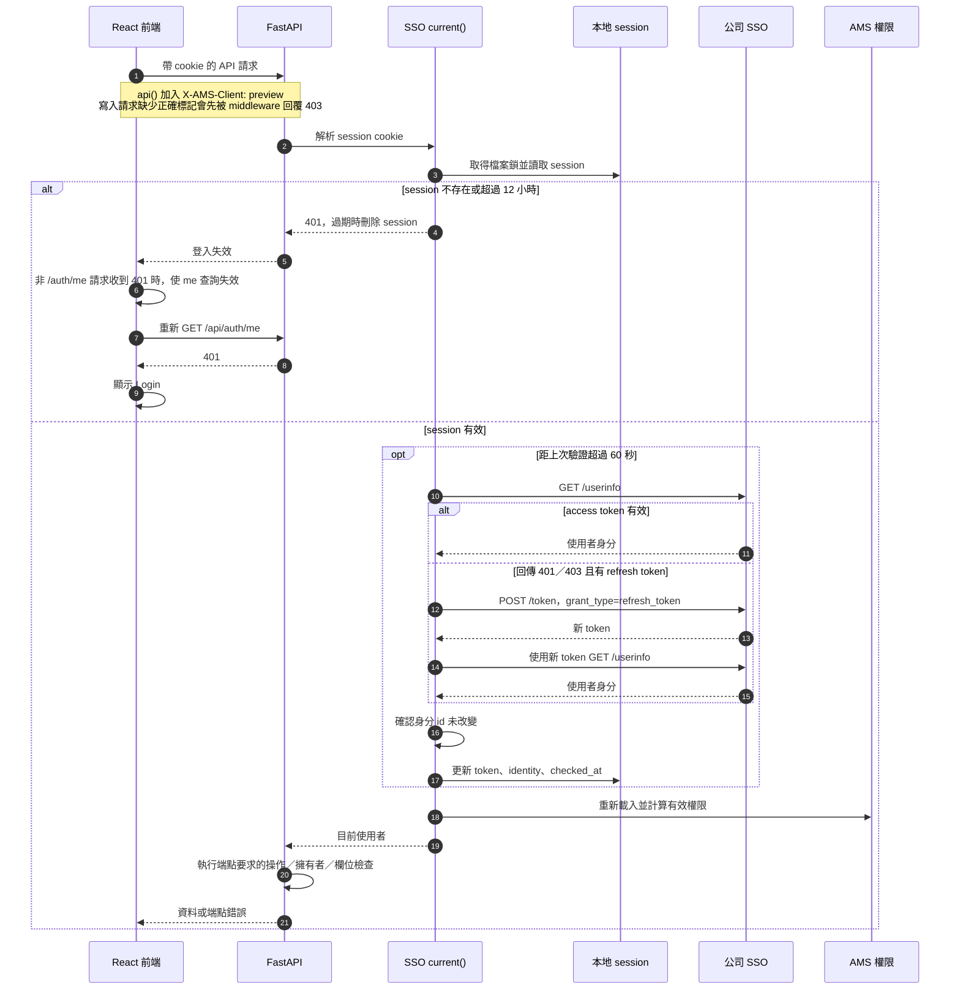
```mermaid
sequenceDiagram
    autonumber
    participant F as React 前端
    participant A as FastAPI
    participant S as SSO current()
    participant L as 本地 session
    participant I as 公司 SSO
    participant P as AMS 權限
    F->>A: 帶 cookie 的 API 請求
    Note over F,A: api() 加入 X-AMS-Client: preview<br/>寫入請求缺少正確標記會先被 middleware 回覆 403
    A->>S: 解析 session cookie
    S->>L: 取得檔案鎖並讀取 session
    alt session 不存在或超過 12 小時
        S-->>A: 401，過期時刪除 session
        A-->>F: 登入失效
        F->>F: 非 /auth/me 請求收到 401 時，使 me 查詢失效
        F->>A: 重新 GET /api/auth/me
        A-->>F: 401
        F->>F: 顯示 Login
    else session 有效
        opt 距上次驗證超過 60 秒
            S->>I: GET /userinfo
            alt access token 有效
                I-->>S: 使用者身分
            else 回傳 401／403 且有 refresh token
                S->>I: POST /token，grant_type=refresh_token
                I-->>S: 新 token
                S->>I: 使用新 token GET /userinfo
                I-->>S: 使用者身分
            end
            S->>S: 確認身分 id 未改變
            S->>L: 更新 token、identity、checked_at
        end
        S->>P: 重新載入並計算有效權限
        S-->>A: 目前使用者
        A->>A: 執行端點要求的操作／擁有者／欄位檢查
        A-->>F: 資料或端點錯誤
    end
```

刷新失敗、無 refresh token 或身分改變時，登入失效；SSO 暫時無法連線可能回傳 502。60 秒是有請求時的重新驗證門檻，不是背景計時器。刷新不延長原本 12 小時期限。React Query 預設不自動重試、staleTime 15 秒、視窗聚焦不重新查詢。

## 05｜登入後的預約日曆首頁

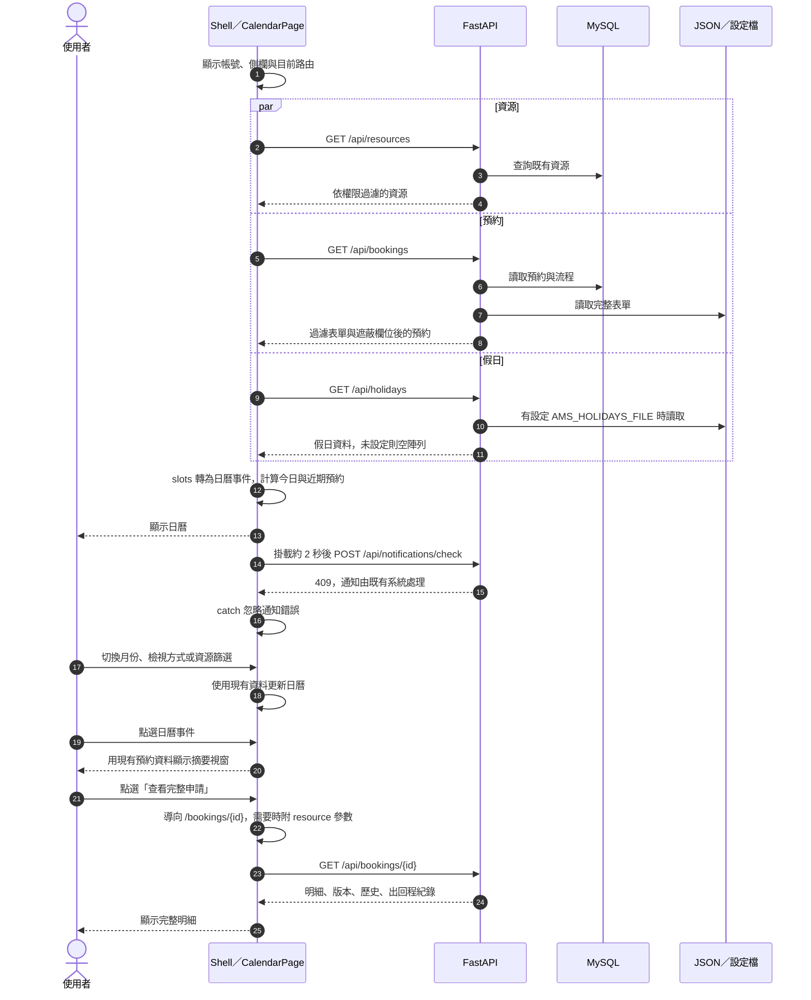
```mermaid
sequenceDiagram
    autonumber
    actor U as 使用者
    participant F as Shell／CalendarPage
    participant A as FastAPI
    participant D as MySQL
    participant J as JSON／設定檔
    F->>F: 顯示帳號、側欄與目前路由
    par 資源
        F->>A: GET /api/resources
        A->>D: 查詢既有資源
        A-->>F: 依權限過濾的資源
    and 預約
        F->>A: GET /api/bookings
        A->>D: 讀取預約與流程
        A->>J: 讀取完整表單
        A-->>F: 過濾表單與遮蔽欄位後的預約
    and 假日
        F->>A: GET /api/holidays
        A->>J: 有設定 AMS_HOLIDAYS_FILE 時讀取
        A-->>F: 假日資料，未設定則空陣列
    end
    F->>F: slots 轉為日曆事件，計算今日與近期預約
    F-->>U: 顯示日曆
    F->>A: 掛載約 2 秒後 POST /api/notifications/check
    A-->>F: 409，通知由既有系統處理
    F->>F: catch 忽略通知錯誤
    U->>F: 切換月份、檢視方式或資源篩選
    F->>F: 使用現有資料更新日曆
    U->>F: 點選日曆事件
    F-->>U: 用現有預約資料顯示摘要視窗
    U->>F: 點選「查看完整申請」
    F->>F: 導向 /bookings/{id}，需要時附 resource 參數
    F->>A: GET /api/bookings/{id}
    A-->>F: 明細、版本、歷史、出回程紀錄
    F-->>U: 顯示完整明細
```

功能路由的 Guard 檢查 read 權限，不通過會顯示「權限不足」與返回首頁連結。欄位另依權限控制；後端仍獨立驗證。首頁通知呼叫不代表新版發送通知。

## 06｜選擇預約類型與載入新增表單

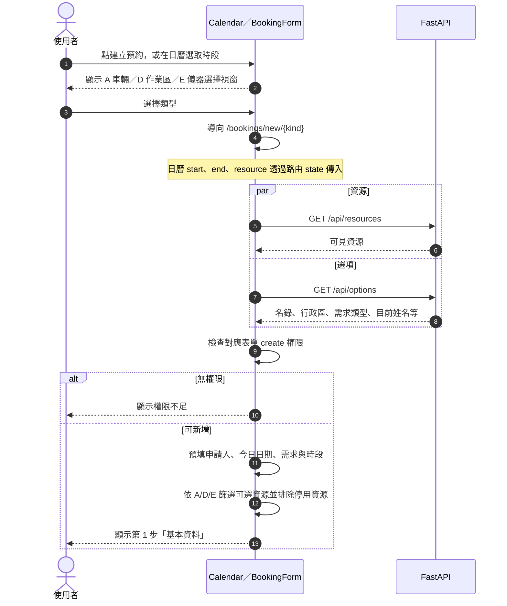
```mermaid
sequenceDiagram
    autonumber
    actor U as 使用者
    participant F as Calendar／BookingForm
    participant A as FastAPI
    U->>F: 點建立預約，或在日曆選取時段
    F-->>U: 顯示 A 車輛／D 作業區／E 儀器選擇視窗
    U->>F: 選擇類型
    F->>F: 導向 /bookings/new/{kind}
    Note over F: 日曆 start、end、resource 透過路由 state 傳入
    par 資源
        F->>A: GET /api/resources
        A-->>F: 可見資源
    and 選項
        F->>A: GET /api/options
        A-->>F: 名錄、行政區、需求類型、目前姓名等
    end
    F->>F: 檢查對應表單 create 權限
    alt 無權限
        F-->>U: 顯示權限不足
    else 可新增
        F->>F: 預填申請人、今日日期、需求與時段
        F->>F: 依 A/D/E 篩選可選資源並排除停用資源
        F-->>U: 顯示第 1 步「基本資料」
    end
```

未帶入時段時，預設今日 09:00 到 17:00；A 可預選日曆選定車輛。人員初始包含目前使用者。修改模式另查詢 GET /api/bookings/{id}，再以原內容 reset 表單。

## 07｜五步表單：每一步的輸入與驗證

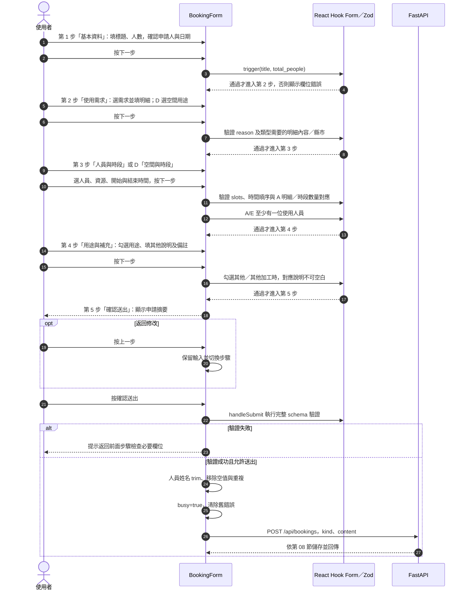
```mermaid
sequenceDiagram
    autonumber
    actor U as 使用者
    participant F as BookingForm
    participant V as React Hook Form／Zod
    participant A as FastAPI
    U->>F: 第 1 步「基本資料」：填標題、人數，確認申請人與日期
    U->>F: 按下一步
    F->>V: trigger(title, total_people)
    V-->>F: 通過才進入第 2 步，否則顯示欄位錯誤
    U->>F: 第 2 步「使用需求」：選需求並填明細；D 選空間用途
    U->>F: 按下一步
    F->>V: 驗證 reason 及類型需要的明細內容／縣市
    V-->>F: 通過才進入第 3 步
    U->>F: 第 3 步「人員與時段」或 D「空間與時段」
    U->>F: 選人員、資源、開始與結束時間，按下一步
    F->>V: 驗證 slots、時間順序與 A 明細／時段數量對應
    F->>V: A/E 至少有一位使用人員
    V-->>F: 通過才進入第 4 步
    U->>F: 第 4 步「用途與補充」：勾選用途、填其他說明及備註
    U->>F: 按下一步
    F->>V: 勾選其他／其他加工時，對應說明不可空白
    V-->>F: 通過才進入第 5 步
    F-->>U: 第 5 步「確認送出」：顯示申請摘要
    opt 返回修改
        U->>F: 按上一步
        F->>F: 保留輸入並切換步驟
    end
    U->>F: 按確認送出
    F->>V: handleSubmit 執行完整 schema 驗證
    alt 驗證失敗
        F-->>U: 提示返回前面步驟檢查必要欄位
    else 驗證成功且允許送出
        F->>F: 人員姓名 trim、移除空值與重複
        F->>F: busy=true，清除舊錯誤
        F->>A: POST /api/bookings，kind、content
        A-->>F: 依第 08 節儲存並回傳
    end
```

前四步不逐步寫入預約，內容留在前端。create 與 submit 是不同權限，能開表單不代表能送出。取消且有未存內容時會詢問是否離開；重新整理／關閉頁面有 beforeunload 提醒。各步驗證失敗會停在原步驟。

## 08｜送出到儲存完成：鎖、衝突、SQL、JSON 與錯誤回復

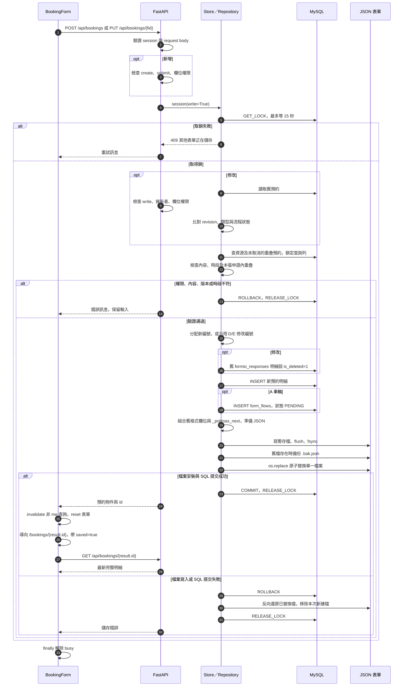
```mermaid
sequenceDiagram
    autonumber
    participant F as BookingForm
    participant A as FastAPI
    participant R as Store／Repository
    participant D as MySQL
    participant J as JSON 表單
    F->>A: POST /api/bookings 或 PUT /api/bookings/{fid}
    A->>A: 驗證 session 與 request body
    opt 新增
        A->>A: 檢查 create、submit、欄位權限
    end
    A->>R: session(write=True)
    R->>D: GET_LOCK，最多等 15 秒
    alt 取鎖失敗
        R-->>A: 409 其他表單正在儲存
        A-->>F: 重試訊息
    else 取得鎖
        opt 修改
            R->>D: 讀取舊預約
            A->>A: 檢查 write、擁有者、欄位權限
            R->>R: 比對 revision、類型與流程狀態
        end
        R->>D: 查資源及未取消的重疊預約，鎖定查詢列
        R->>R: 檢查內容、時段及本張申請內重疊
        alt 權限、內容、版本或時段不符
            R->>D: ROLLBACK，RELEASE_LOCK
            A-->>F: 錯誤訊息，保留輸入
        else 驗證通過
            R->>R: 分配新編號，或沿用 D/E 修改編號
            opt 修改
                R->>D: 舊 formio_responses 明細設 is_deleted=1
            end
            R->>D: INSERT 新預約明細
            opt A 車輛
                R->>D: INSERT form_flows，狀態 PENDING
            end
            R->>R: 組合舊格式欄位與 _polimax_next，準備 JSON
            R->>J: 寫暫存檔、flush、fsync
            R->>J: 舊檔存在時備份 .bak.json
            R->>J: os.replace 原子替換單一檔案
            alt 檔案安裝與 SQL 提交成功
                R->>D: COMMIT，RELEASE_LOCK
                A-->>F: 預約物件與 id
                F->>F: invalidate 非 me 查詢，reset 表單
                F->>F: 導向 /bookings/{result.id}，帶 saved=true
                F->>A: GET /api/bookings/{result.id}
                A-->>F: 最新完整明細
            else 檔案寫入或 SQL 提交失敗
                R->>D: ROLLBACK
                R->>J: 反向還原已替換檔，移除本次新建檔
                R->>D: RELEASE_LOCK
                A-->>F: 儲存錯誤
            end
        end
    end
    F->>F: finally 解除 busy
```

修改 A 產生新編號及 previous_id；已發車的 A 不可重新安排。D/E 修改沿用編號。前端沒有先呼叫 /bookings/check；儲存內的衝突判斷包含相接時間邊界。SQL 與檔案系統不是同一個原子交易，回復處理適用於程式能捕捉的錯誤。

## 09｜借用紀錄、修改與取消

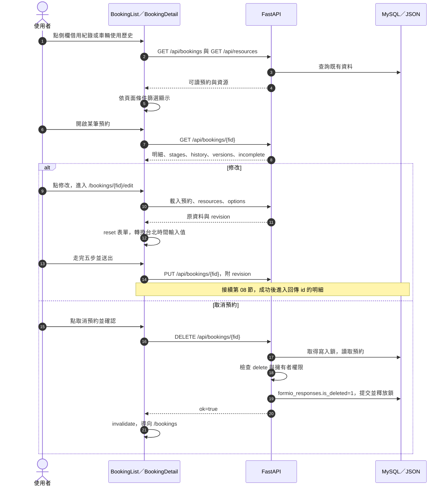
```mermaid
sequenceDiagram
    autonumber
    actor U as 使用者
    participant F as BookingList／BookingDetail
    participant A as FastAPI
    participant D as MySQL／JSON
    U->>F: 點側欄借用紀錄或車輛使用歷史
    F->>A: GET /api/bookings 與 GET /api/resources
    A->>D: 查詢既有資料
    A-->>F: 可讀預約與資源
    F->>F: 依頁面條件篩選顯示
    U->>F: 開啟某筆預約
    F->>A: GET /api/bookings/{fid}
    A-->>F: 明細、stages、history、versions、incomplete
    alt 修改
        U->>F: 點修改，進入 /bookings/{fid}/edit
        F->>A: 載入預約、resources、options
        A-->>F: 原資料與 revision
        F->>F: reset 表單，轉換台北時間輸入值
        U->>F: 走完五步並送出
        F->>A: PUT /api/bookings/{fid}，附 revision
        Note over F,D: 接續第 08 節，成功後進入回傳 id 的明細
    else 取消預約
        U->>F: 點取消預約並確認
        F->>A: DELETE /api/bookings/{fid}
        A->>D: 取得寫入鎖，讀取預約
        A->>A: 檢查 delete 與擁有者權限
        A->>D: formio_responses.is_deleted=1，提交並釋放鎖
        A-->>F: ok=true
        F->>F: invalidate，導向 /bookings
    end
```

取消是 SQL 明細標記取消，不刪除 JSON。incomplete 用於標示流程狀態與既有出回程檔案不完整的情況。

## 10｜車輛出回程：四次獨立送出

| 次序 | 目前狀態 | 操作 | JSON 動作 | 成功後狀態 |
| --- | --- | --- | --- | --- |
| 1 | PENDING | 填寫發車表 | 建立 B 的 start | DEPARTURE |
| 2 | DEPARTURE | 填寫發車抵達 | 補 B 的 arrival | DEPARTURE_ARRIVED |
| 3 | DEPARTURE_ARRIVED | 填寫還車表 | 建立 C 的 start | RETURN |
| 4 | RETURN | 填寫還車抵達 | 補 C 的 arrival | RETURN_ARRIVED |

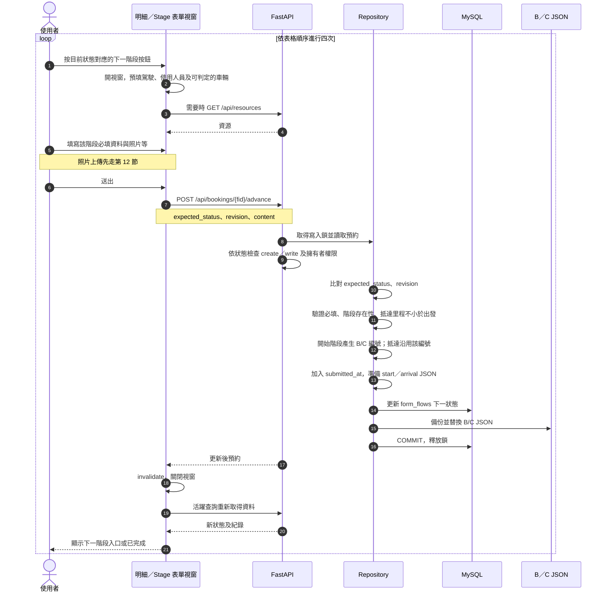
```mermaid
sequenceDiagram
    autonumber
    actor U as 使用者
    participant F as 明細／Stage 表單視窗
    participant A as FastAPI
    participant R as Repository
    participant D as MySQL
    participant J as B／C JSON
    loop 依表格順序進行四次
        U->>F: 按目前狀態對應的下一階段按鈕
        F->>F: 開視窗，預填駕駛、使用人員及可判定的車輛
        F->>A: 需要時 GET /api/resources
        A-->>F: 資源
        U->>F: 填寫該階段必填資料與照片等
        Note over U,F: 照片上傳先走第 12 節
        U->>F: 送出
        F->>A: POST /api/bookings/{fid}/advance
        Note over F,A: expected_status、revision、content
        A->>R: 取得寫入鎖並讀取預約
        A->>A: 依狀態檢查 create／write 及擁有者權限
        R->>R: 比對 expected_status、revision
        R->>R: 驗證必填、階段存在性、抵達里程不小於出發
        R->>R: 開始階段產生 B/C 編號；抵達沿用該編號
        R->>R: 加入 submitted_at，準備 start／arrival JSON
        R->>D: 更新 form_flows 下一狀態
        R->>J: 備份並替換 B/C JSON
        R->>D: COMMIT，釋放鎖
        A-->>F: 更新後預約
        F->>F: invalidate，關閉視窗
        F->>A: 活躍查詢重新取得資料
        A-->>F: 新狀態及紀錄
        F-->>U: 顯示下一階段入口或已完成
    end
```

只適用 A 車輛。驗證失敗不推進狀態，前端保留視窗並顯示錯誤；寫入回復同第 08 節。車輛預選使用 resource 查詢參數，或預約中唯一資源。

## 11｜查詢、編輯與刪除出回程紀錄

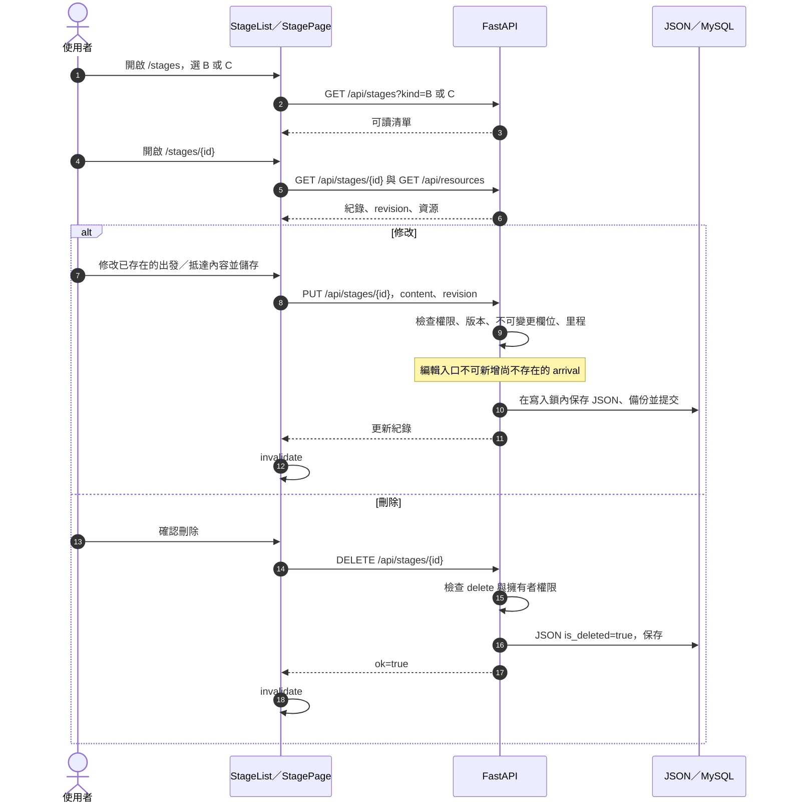
```mermaid
sequenceDiagram
    autonumber
    actor U as 使用者
    participant F as StageList／StagePage
    participant A as FastAPI
    participant D as JSON／MySQL
    U->>F: 開啟 /stages，選 B 或 C
    F->>A: GET /api/stages?kind=B 或 C
    A-->>F: 可讀清單
    U->>F: 開啟 /stages/{id}
    F->>A: GET /api/stages/{id} 與 GET /api/resources
    A-->>F: 紀錄、revision、資源
    alt 修改
        U->>F: 修改已存在的出發／抵達內容並儲存
        F->>A: PUT /api/stages/{id}，content、revision
        A->>A: 檢查權限、版本、不可變更欄位、里程
        Note over A: 編輯入口不可新增尚不存在的 arrival
        A->>D: 在寫入鎖內保存 JSON、備份並提交
        A-->>F: 更新紀錄
        F->>F: invalidate
    else 刪除
        U->>F: 確認刪除
        F->>A: DELETE /api/stages/{id}
        A->>A: 檢查 delete 與擁有者權限
        A->>D: JSON is_deleted=true，保存
        A-->>F: ok=true
        F->>F: invalidate
    end
```

此刪除端點不會自動將父預約狀態退回前一階段。

## 12｜附件上傳、預覽與下載

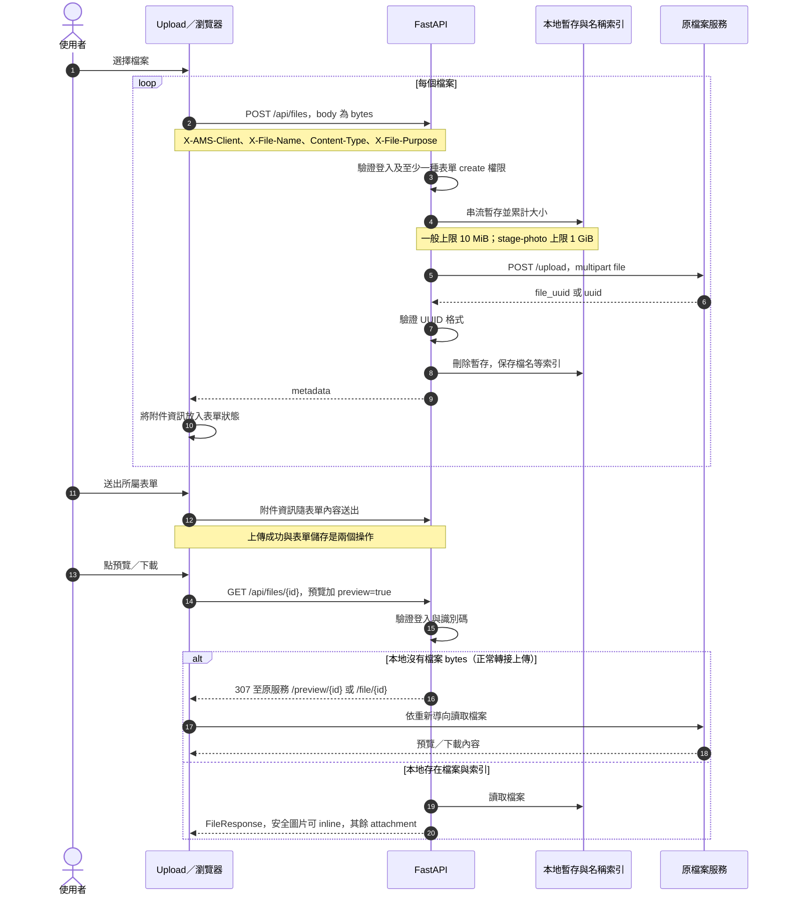
```mermaid
sequenceDiagram
    autonumber
    actor U as 使用者
    participant F as Upload／瀏覽器
    participant A as FastAPI
    participant L as 本地暫存與名稱索引
    participant S as 原檔案服務
    U->>F: 選擇檔案
    loop 每個檔案
        F->>A: POST /api/files，body 為 bytes
        Note over F,A: X-AMS-Client、X-File-Name、Content-Type、X-File-Purpose
        A->>A: 驗證登入及至少一種表單 create 權限
        A->>L: 串流暫存並累計大小
        Note over A,L: 一般上限 10 MiB；stage-photo 上限 1 GiB
        A->>S: POST /upload，multipart file
        S-->>A: file_uuid 或 uuid
        A->>A: 驗證 UUID 格式
        A->>L: 刪除暫存，保存檔名等索引
        A-->>F: metadata
        F->>F: 將附件資訊放入表單狀態
    end
    U->>F: 送出所屬表單
    F->>A: 附件資訊隨表單內容送出
    Note over F,A: 上傳成功與表單儲存是兩個操作
    U->>F: 點預覽／下載
    F->>A: GET /api/files/{id}，預覽加 preview=true
    A->>A: 驗證登入與識別碼
    alt 本地沒有檔案 bytes（正常轉接上傳）
        A-->>F: 307 至原服務 /preview/{id} 或 /file/{id}
        F->>S: 依重新導向讀取檔案
        S-->>F: 預覽／下載內容
    else 本地存在檔案與索引
        A->>L: 讀取檔案
        A-->>F: FileResponse，安全圖片可 inline，其餘 attachment
    end
```

超過上限回傳 413；外部上傳失敗／UUID 無效回傳 502。失敗時清理暫存並在前端顯示錯誤。

## 13｜車輛／儀器與附屬紀錄管理

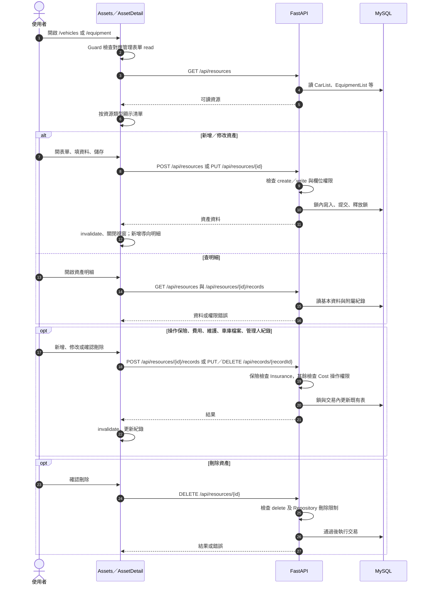
```mermaid
sequenceDiagram
    autonumber
    actor U as 使用者
    participant F as Assets／AssetDetail
    participant A as FastAPI
    participant D as MySQL
    U->>F: 開啟 /vehicles 或 /equipment
    F->>F: Guard 檢查對應管理表單 read
    F->>A: GET /api/resources
    A->>D: 讀 CarList、EquipmentList 等
    A-->>F: 可讀資源
    F->>F: 按資源類型顯示清單
    alt 新增／修改資產
        U->>F: 開表單、填資料、儲存
        F->>A: POST /api/resources 或 PUT /api/resources/{id}
        A->>A: 檢查 create／write 與欄位權限
        A->>D: 鎖內寫入、提交、釋放鎖
        A-->>F: 資產資料
        F->>F: invalidate、關閉視窗；新增導向明細
    else 查明細
        U->>F: 開啟資產明細
        F->>A: GET /api/resources 與 /api/resources/{id}/records
        A->>D: 讀基本資料與附屬紀錄
        A-->>F: 資料或權限錯誤
    end
    opt 操作保險、費用、維護、車庫檔案、管理人紀錄
        U->>F: 新增、修改或確認刪除
        F->>A: POST /api/resources/{id}/records 或 PUT／DELETE /api/records/{recordId}
        A->>A: 保險檢查 Insurance，其餘檢查 Cost 操作權限
        A->>D: 鎖與交易內更新既有表
        A-->>F: 結果
        F->>F: invalidate，更新紀錄
    end
    opt 刪除資產
        U->>F: 確認刪除
        F->>A: DELETE /api/resources/{id}
        A->>A: 檢查 delete 及 Repository 刪除限制
        A->>D: 通過後執行交易
        A-->>F: 結果或錯誤
    end
```

目前附屬紀錄讀取端點固定檢查 VehicleManagement.read，即使由儀器明細觸發也是如此。

## 14｜最新位置、軌跡、場內掃描、Beacon 位置

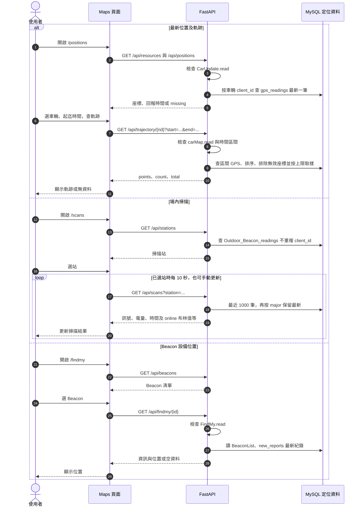
```mermaid
sequenceDiagram
    autonumber
    actor U as 使用者
    participant F as Maps 頁面
    participant A as FastAPI
    participant D as MySQL 定位資料
    alt 最新位置及軌跡
        U->>F: 開啟 /positions
        F->>A: GET /api/resources 與 /api/positions
        A->>A: 檢查 CarUpdate.read
        A->>D: 按車輛 client_id 查 gps_readings 最新一筆
        A-->>F: 座標、回報時間或 missing
        U->>F: 選車輛、起迄時間，查軌跡
        F->>A: GET /api/trajectory/{rid}?start=...&end=...
        A->>A: 檢查 carMap.read 與時間區間
        A->>D: 查區間 GPS、排序、排除無效座標並按上限取樣
        A-->>F: points、count、total
        F-->>U: 顯示軌跡或無資料
    else 場內掃描
        U->>F: 開啟 /scans
        F->>A: GET /api/stations
        A->>D: 查 Outdoor_Beacon_readings 不重複 client_id
        A-->>F: 掃描站
        U->>F: 選站
        loop 已選站時每 10 秒，也可手動更新
            F->>A: GET /api/scans?station=...
            A->>D: 最近 1000 筆，再按 major 保留最新
            A-->>F: 訊號、電量、時間及 online 布林值等
            F-->>U: 更新掃描結果
        end
    else Beacon 設備位置
        U->>F: 開啟 /findmy
        F->>A: GET /api/beacons
        A-->>F: Beacon 清單
        U->>F: 選 Beacon
        F->>A: GET /api/findmy/{id}
        A->>A: 檢查 FindMy.read
        A->>D: 讀 BeaconList、new_reports 最新紀錄
        A-->>F: 資訊與位置或空資料
        F-->>U: 顯示位置
    end
```

定位資料來自既有匯入程序。沒有資料回傳空值／空清單，查詢不會產生新座標。

## 15｜Beacon 管理、權限同步與資料來源

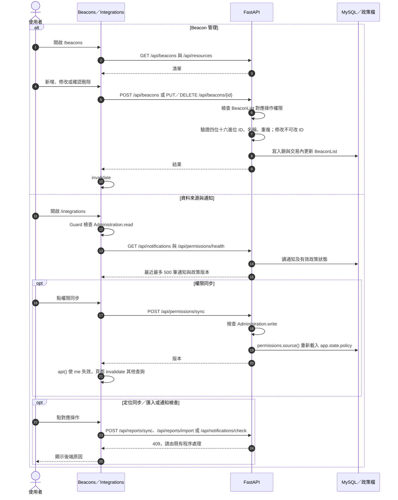
```mermaid
sequenceDiagram
    autonumber
    actor U as 使用者
    participant F as Beacons／Integrations
    participant A as FastAPI
    participant D as MySQL／政策檔
    alt Beacon 管理
        U->>F: 開啟 /beacons
        F->>A: GET /api/beacons 與 /api/resources
        A-->>F: 清單
        U->>F: 新增、修改或確認刪除
        F->>A: POST /api/beacons 或 PUT／DELETE /api/beacons/{id}
        A->>A: 檢查 BeaconList 對應操作權限
        A->>A: 驗證四位十六進位 ID、名稱、重複；修改不可改 ID
        A->>D: 寫入鎖與交易內更新 BeaconList
        A-->>F: 結果
        F->>F: invalidate
    else 資料來源與通知
        U->>F: 開啟 /integrations
        F->>F: Guard 檢查 Administration.read
        F->>A: GET /api/notifications 與 /api/permissions/health
        A->>D: 讀通知及有效政策狀態
        A-->>F: 最近最多 500 筆通知與政策版本
        opt 權限同步
            U->>F: 點權限同步
            F->>A: POST /api/permissions/sync
            A->>A: 檢查 Administration.write
            A->>D: permissions.source() 重新載入 app.state.policy
            A-->>F: 版本
            F->>F: api() 使 me 失效，頁面 invalidate 其他查詢
        end
        opt 定位同步／匯入或通知檢查
            U->>F: 點對應操作
            F->>A: POST /api/reports/sync、/api/reports/import 或 /api/notifications/check
            A-->>F: 409，請由既有程序處理
            F-->>U: 顯示後端原因
        end
    end
```

SSO 有效權限仍由 sso.with_permissions() 讀政策／快照；同步按鈕不向外部 AMS 拉取新快照。管理頁有部分測試模式文案，本圖依正式 API 實作記錄。

## 16｜登出，回到登入頁

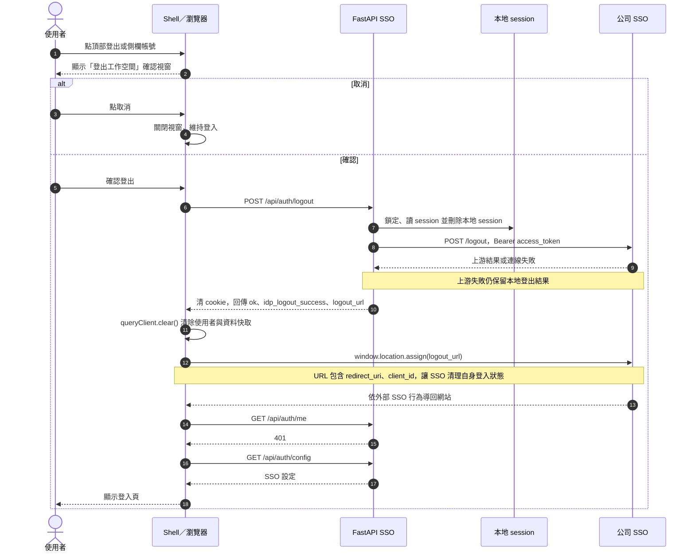
```mermaid
sequenceDiagram
    autonumber
    actor U as 使用者
    participant F as Shell／瀏覽器
    participant A as FastAPI SSO
    participant L as 本地 session
    participant I as 公司 SSO
    U->>F: 點頂部登出或側欄帳號
    F-->>U: 顯示「登出工作空間」確認視窗
    alt 取消
        U->>F: 點取消
        F->>F: 關閉視窗，維持登入
    else 確認
        U->>F: 確認登出
        F->>A: POST /api/auth/logout
        A->>L: 鎖定、讀 session 並刪除本地 session
        A->>I: POST /logout，Bearer access_token
        I-->>A: 上游結果或連線失敗
        Note over A,I: 上游失敗仍保留本地登出結果
        A-->>F: 清 cookie，回傳 ok、idp_logout_success、logout_url
        F->>F: queryClient.clear() 清除使用者與資料快取
        F->>I: window.location.assign(logout_url)
        Note over F,I: URL 包含 redirect_uri、client_id，讓 SSO 清理自身登入狀態
        I-->>F: 依外部 SSO 行為導回網站
        F->>A: GET /api/auth/me
        A-->>F: 401
        F->>A: GET /api/auth/config
        A-->>F: SSO 設定
        F-->>U: 顯示登入頁
    end
```

若登出 API 本身失敗，前端保留確認視窗、顯示錯誤，不清快取或跳轉。外部 SSO 最後是否完成導回取決於該服務當下回應。

## 程式對照與驗證範圍

| 流程 | 原始碼 |
| --- | --- |
| 啟動、登入頁、路由、登出 | src/main.tsx、src/App.tsx |
| API、錯誤、快取 | src/api.ts |
| 前端權限 | src/Access.tsx |
| SSO、token、session、角色 | backend/sso.py |
| 日曆、五步預約 | src/Calendar.tsx、src/Bookings.tsx |
| 出回程 | src/Stages.tsx |
| 資產、地圖、管理 | src/Assets.tsx、src/Maps.tsx、src/Admin.tsx |
| 附件 UI | src/ui.tsx |
| 正式 API、授權與附件轉接 | backend/legacy_api.py |
| SQL、JSON、鎖、交易、狀態 | backend/legacy_store.py |
| 定位、Beacon、通知、匯入 | backend/legacy_integrations.py |

這些圖依原始碼靜態分析，不代表已操作真實公司帳號完成端到端驗證。外部 IdP／檔案服務只呈現本專案可確認的邊界。隔離 demo／test 的角色選擇登入不屬於本文件的正式流程。
